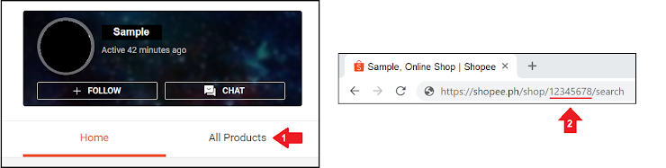

# ecom-shop-matcher
Finding potential matching shops between e-commerce platforms

E-commerce platforms used: Shopee and Lazada
Shopee: https://shopee.ph/
Lazada: https://www.lazada.com.ph/
  
## Endpoints

## Shopee Match Shop
Matching Shopee to Lazada

`/api/shopee/match-shop`
- Given a Shopee Shop ID, the function looks for identical Lazada shops.
- Method: POST; Accept: application/json

## How to find a Shopee Shop ID



```js
// payload
{
    // Shop ID of shopee shop
    "shopid": 12345,
    
    // optional
    "proxy": {
        "http": "http://sample.proxy",
        "https": "https://sample.proxy"
    }
}

// 200 response body
{
    "_duration": '0.45 s',
    "data": {
        "shopid": 12345,
        "match_list": [
            {
                "shopid": 12345, // Shopee shop id
                "username": "Shopee Username",
                "sellerName": "Lazada Seller Name",
                "shop_url": "Lazada Shop URL",
                "percent_shopee_covered": 0.50, // Percent of items on the Shopee shop that were matched on the Lazada shop
                "percent_lazada_covered": 0.40 // Percent of items on the Lazada shop that were matched on the Shopee shop
            }
        ]
    }
}

```
